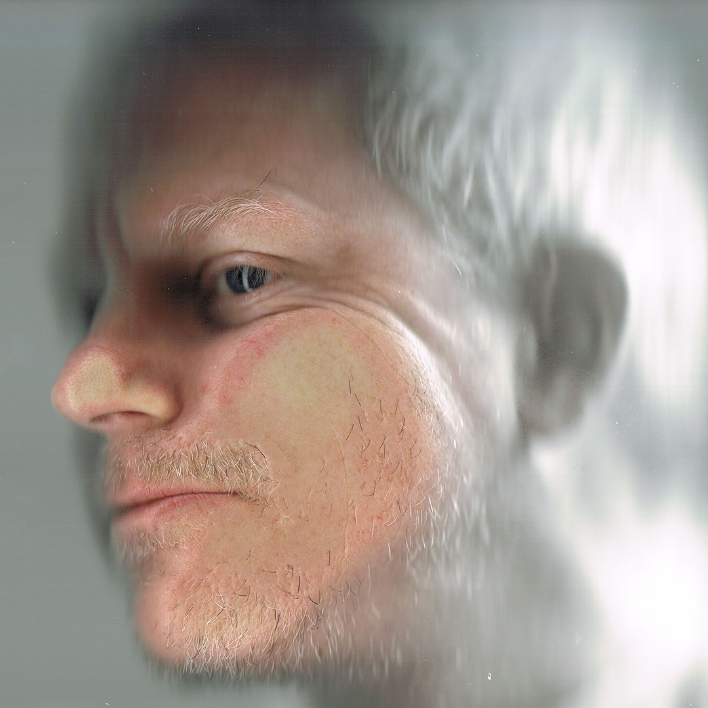

Professionally, I am a supervisor at Weta Digital currently leading a small team crafting real time interactive VR experiences using IP related to feature film visual effects work underway at Weta Digital.  I have worked through a number of roles over my 18 years in visual effects including Visual Effects Artist, CG Supervisor, FX Department head, and Pipeline Supervisor where I managed large software development efforts related to virtual production.  In addition I am a part time educator at Victoria University of Wellington with the School of Design.

Additionally, I am an active visual artist working across many mediums.  My creative practice currently is centered around virtual and augmented reality and traditional painting in oil.

I have a Bachelor of Fine Arts from the School of Visual Arts in New York City.

[IMDB Profile](http://www.imdb.com/name/nm1541102/)

